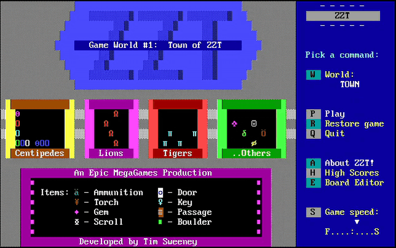

# ZZT, in Elixir, over a WebSocket



A port of Tim Sweeney's 1991 shareware classic [ZZT](https://en.wikipedia.org/wiki/ZZT),
reading `.ZZT` world files directly and rendering the 80×25 CP437 display
inside a Phoenix LiveView. Stats tick on the server, diffs go out over a
WebSocket, and your browser paints the bear that wants to eat you.

## Why does this exist

It shouldn't. "Just because you could" etc.

ZZT ran on a single-digit-MHz 8088 with a CGA card that wrote directly to
B800:0000, and it ran *fine*. The game loop was a tight `while` over
`Board.Stats[]` polling the keyboard at the speed of a malfunctioning DMA
controller. Porting that loop to a stack where every on-screen character
is serialized as a map diff, gzipped, punted through a WebSocket, then
stitched into the DOM by a virtual-DOM-ish patcher... is not a sensible
architectural choice. The 5¼" floppy this shipped on had more spare I/O
budget than we do.

But: the reference port is Pascal, Elixir pattern matches sum types like
destructible-vs-pushable-vs-walkable tiles with basically zero ceremony,
`%{{x, y} => {element, color}}` is a perfectly respectable way to model a
board, and LiveView's existing diff machinery happens to be pretty good at
"push 1,500 tiny colored squares around at 10 Hz." So it works. It
shouldn't, but it does. Carefully unwrapping what the reference is doing
one element at a time has been more fun than it has any right to be.

## Running it

```
mix setup
mix phx.server
```

Then open [`localhost:4000`](http://localhost:4000) and pick a world. Drop
any `.ZZT` file into `priv/games/` and it shows up in the library.

### Controls

| Key            | What it does                                         |
| -------------- | ---------------------------------------------------- |
| Arrows         | Move / push / pick up                                |
| Shift + arrow  | Shoot                                                |
| `T`            | Light a torch                                        |
| `P`            | Pause                                                |
| `Esc`          | Dismiss a scroll, or bail back to the library        |
| `A` (on title) | About                                                |

## What's in

Roughly ZZT's full gameplay surface — enough to play through `TOWN.ZZT`
end to end:

- Every stock element: lions, tigers, bears, centipedes, ruffians,
  sharks, slime, pushers, conveyors, bullets, stars, spinning guns,
  bombs, blink walls, transporters, energizers, passages, doors/keys,
  scrolls, breakable/normal/fake/invisible walls.
- The ZZT-OOP interpreter — `#walk`, `#go`, `#try`, `#shoot`,
  `#send target:label`, `#if flag`, `#give/#take`, `#become`, `#put`,
  `#change`, `#bind`, `#zap`/`#restore`, `#lock`/`#unlock`, `#die`,
  `#endgame`, conditions, text scrolls, `:TOUCH` / `:SHOT` / `:BOMBED` /
  `:ENERGIZE` / `:THUD` labels.
- Dark rooms + torches (with the ellipse radius).
- The full sidebar including the torch gauge, pausing indicator, and
  board timer; the title-screen Monitor menu with Play / World / About.
- `ReenterWhenZapped` boards, the "Ouch!" / "Game over" message system,
  board timers that damage you, bomb fuse + blast, ricochets, and all
  the little touches.

## What's out

- Sound. ZZT queued PC-speaker tunes on essentially every interaction;
  the port is silent. Web Audio is the next frontier.
- Save/restore, high scores, the board editor. None of the non-game
  menu commands are wired up — `R`, `Q`, `H`, `E` on the title screen
  render but no-op.
- Super ZZT.

## Built on the shoulders of

- [Tim Sweeney](https://en.wikipedia.org/wiki/Tim_Sweeney_(game_developer))
  for the original.
- [Adrian Siekierka's reconstruction-of-zzt](https://github.com/asiekierka/reconstruction-of-zzt)
  — the annotated Pascal source release. Nearly every Elixir module
  here has a `GAME.PAS:1234` / `ELEMENTS.PAS:567` breadcrumb pointing
  at its reference implementation.
- The [Museum of ZZT](https://museumofzzt.com/) for preserving worlds.
